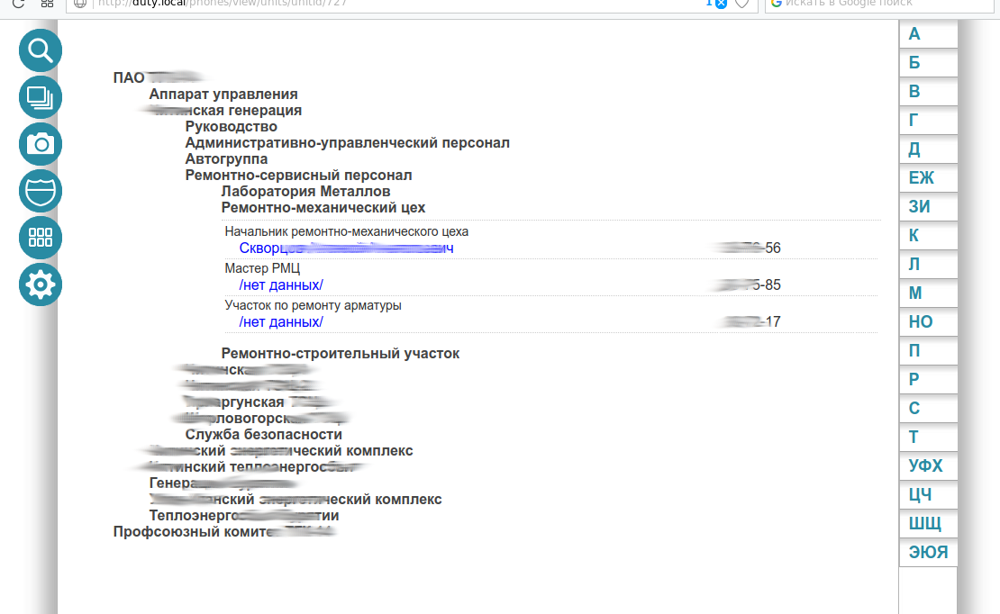
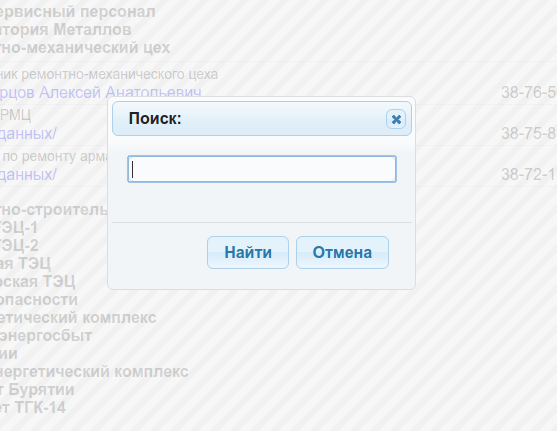
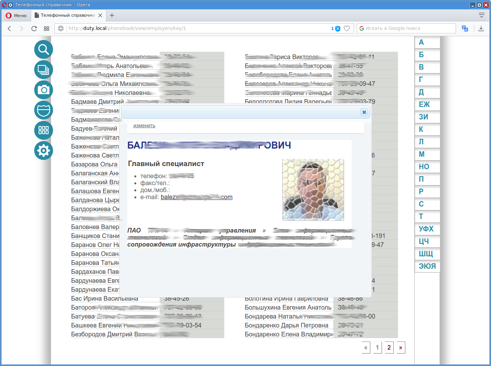

# LAN Phonebook

Телефонный справочник в режиме WiKi для корпоративной локальной сети

Иерархический список подразделений и сотрудников



Диалог поиска данных



Карточка сотрудника




## Install

Для работы требуется установить `sqlite3-pcre`, включить в файле ``php.ini`` расширение ``sqlite3`` и указать путь к каталогу, в котором находится
расширение ``pcre.so``. Для Debian это:
```
sqlite3.extension_dir = "/usr/lib/sqlite3"
```

Активировать ``rewrite_module`` веб-сервера, и установить PHP-модули ``php-sqlite3``, ``php_mbstring``.

Для установки разместите содержимое репозитория в каталог веб-сервера и скопируйте установочный файл данных в рабочую базу:
```bash
cd /var/www/html/
git clone --recursive --single-branch -b main https://github.com/bigov/phonebook.git
cp phonebook/db/phones.sqlite.INSTALL phonebook/dbphones.sqlite
```

и предоставить права записи веб-серверу на папки ``photos``, ``db``, ``templates_c``.

Подробности настройки см. в [Wiki](https://github.com/bigov/phonebook/wiki)
